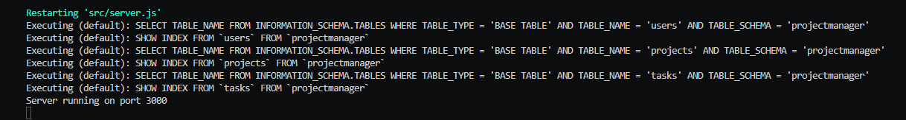
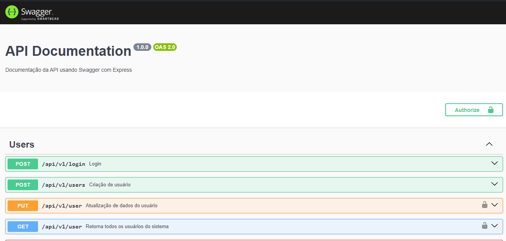

# Project Manager

`Avaliação Final da matéria de backend.`

`3º semestre - ADS - Faculdade Senac`

Objetivo: desenvolver um sistema de gerenciamento de projetos e tarefas

Para inicialzar a aplicação executar `npm run dev`, confira se o seu terminal aparece o seghuinte:


Para conferir os endpoints da api veja a documentação em `http://localhost:3000/api/docs/#/`, conforme imagem a seguir:



Projeto desenvolvido utilizando:

- node.js
- express
- bcrypt
- sequelize
- mysql

Comandos utilizados para instalação das dependencias:

```
 npm i express bcrypt sequelize mysql2
```

→ Arquitetura: MVC
